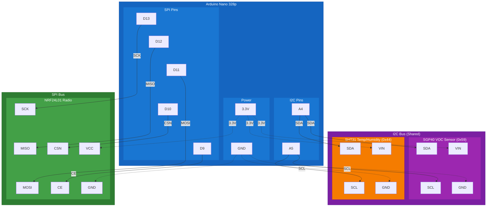

# VOC Sensor Protoboard Wiring Diagram

## Wiring Diagram

## Connection Tables

### SPI Bus (NRF24L01 Radio Module)

| Arduino Pin | NRF24L01 Pin | Signal |
|-------------|--------------|--------|
| D13 | SCK | Serial Clock |
| D12 | MISO | Master In, Slave Out |
| D11 | MOSI | Master Out, Slave In |
| D10 | CSN | Chip Select (active low) |
| D9 | CE | Chip Enable |
| 3.3V | VCC | Power (3.3V only!) |
| GND | GND | Ground |

### I2C Bus (Sensors - Shared)

| Arduino Pin | SGP40 Pin | SHT31 Pin | Signal |
|-------------|-----------|-----------|--------|
| A4 | SDA | SDA | I2C Data |
| A5 | SCL | SCL | I2C Clock |
| 3.3V | VIN | VIN | Power |
| GND | GND | GND | Ground |

### I2C Device Addresses

| Device | Address | Description |
|--------|---------|-------------|
| SGP40 | 0x59 | VOC Sensor |
| SHT31 | 0x44 | Temperature/Humidity |

## Notes

- **All three modules share the 3.3V power rail** from the Arduino Nano
- NRF24L01, SGP40, and SHT31 all operate at 3.3V logic/power
- Both I2C sensors share the same bus (different addresses)
- SPI pins (D11-D13) are hardware SPI on Arduino Nano
- CE and CSN can be any digital pins (D9, D10 chosen here)
- Pull-up resistors for I2C are typically built into breakout boards
- The NRF24 needs a capacitor added between the VCC and GND pins direcly on the breakout board. This is needed to properly condition the power. Capacitor selected based on online forums is $100\mu F$
