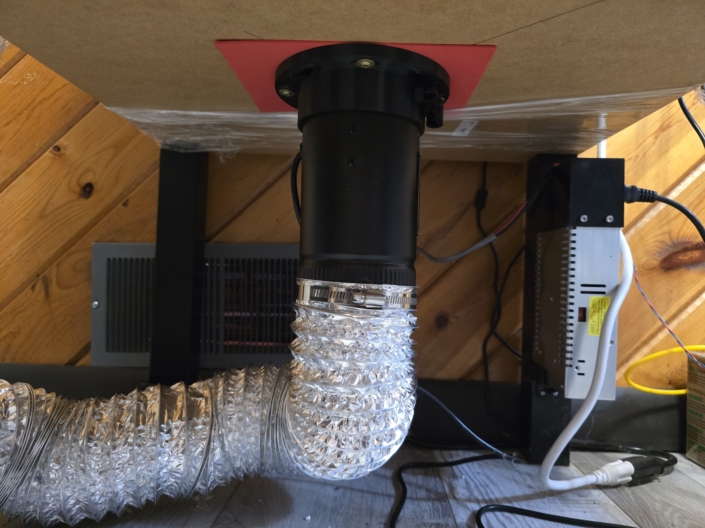
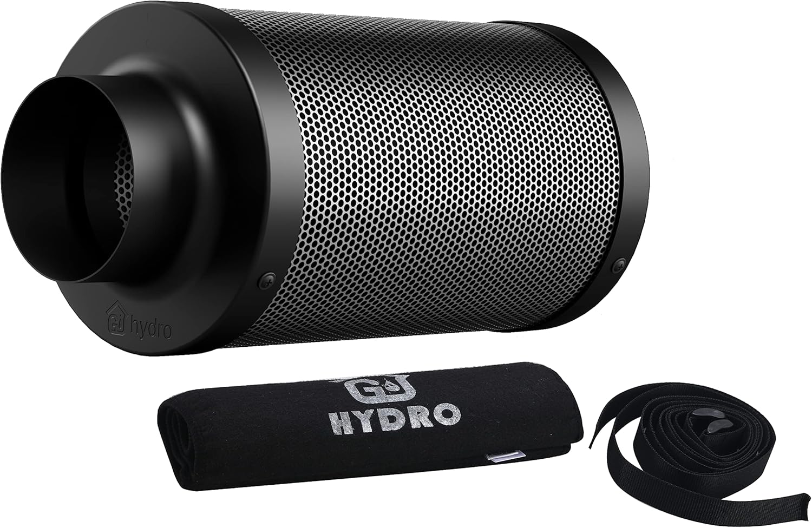
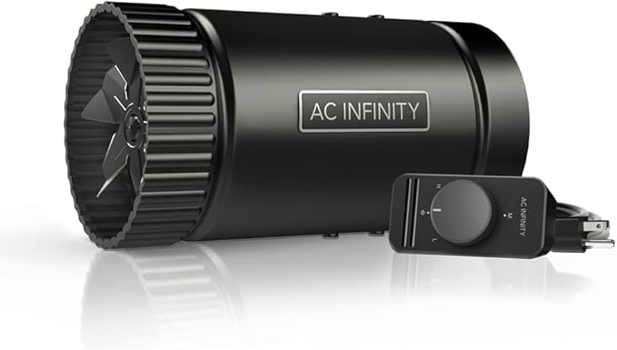
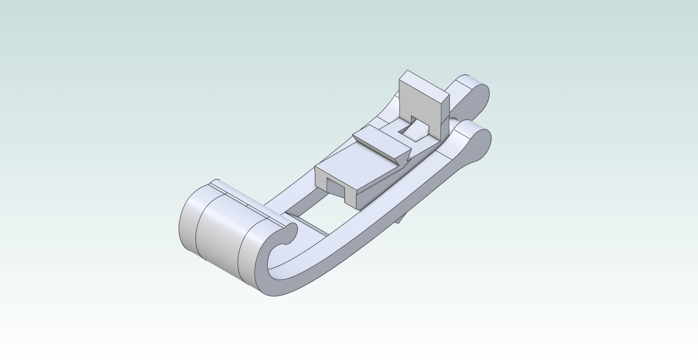
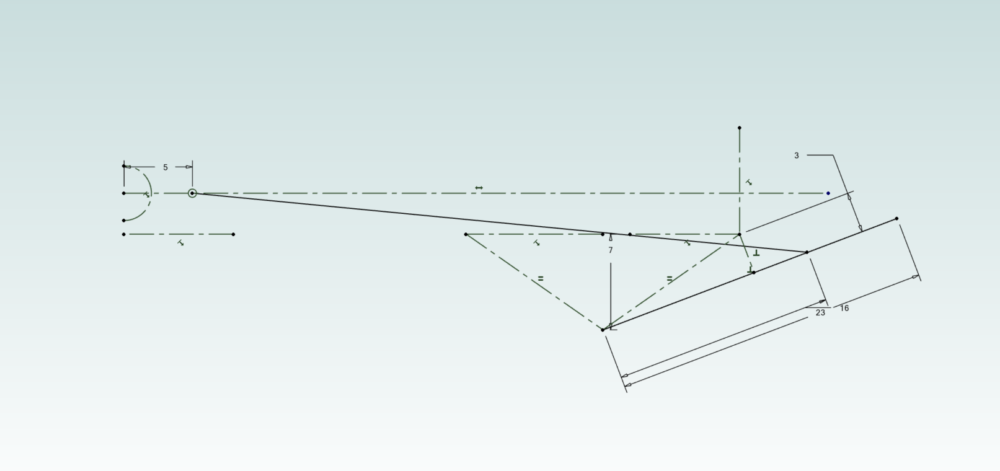
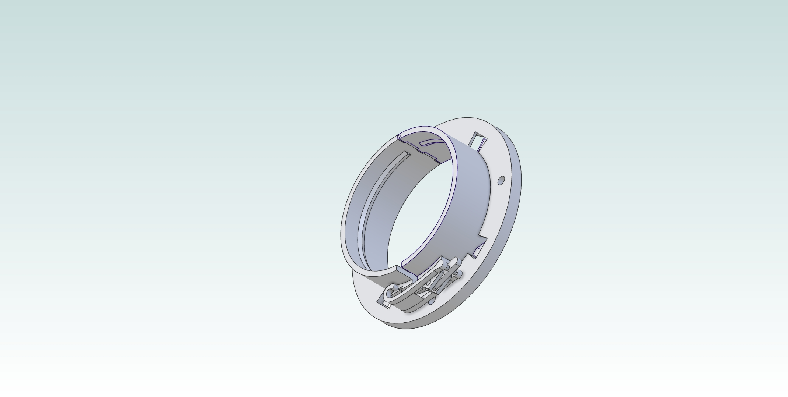
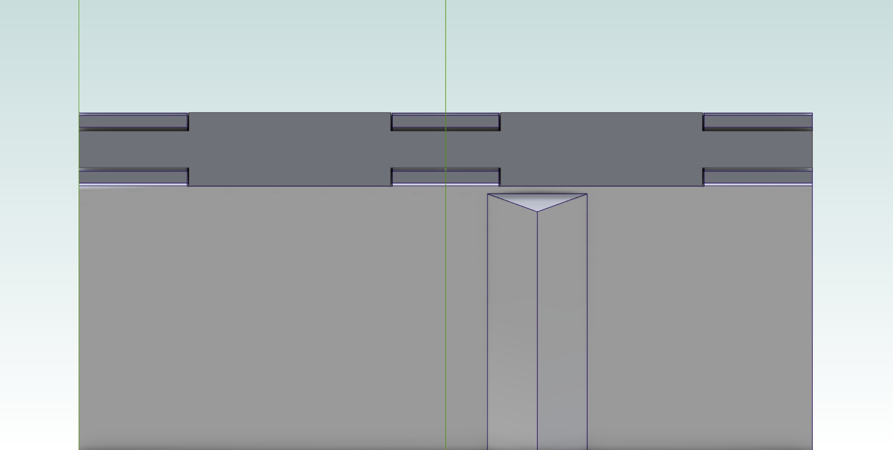
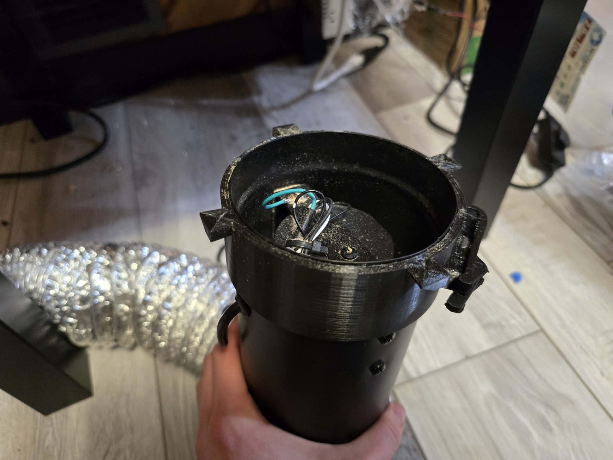
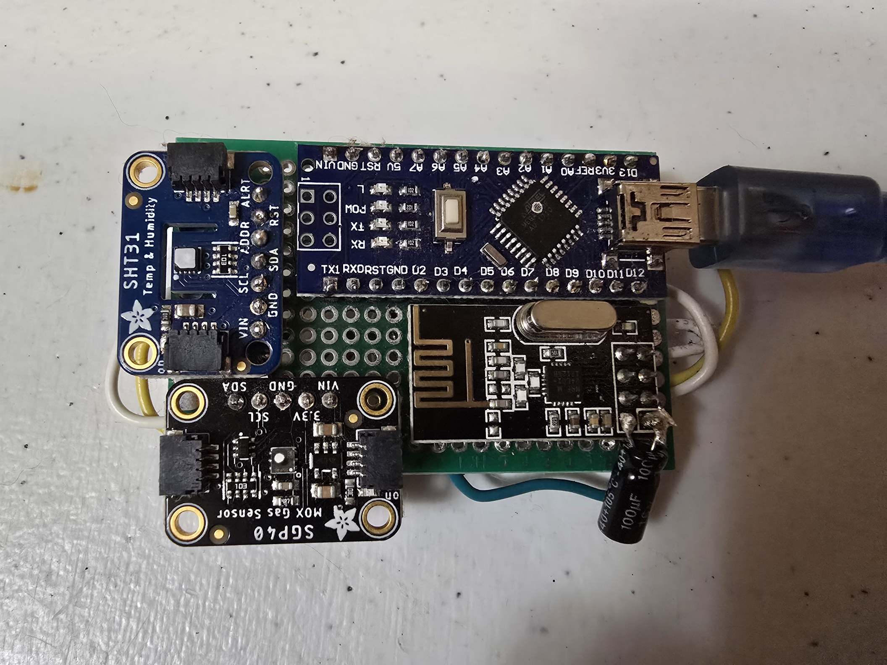
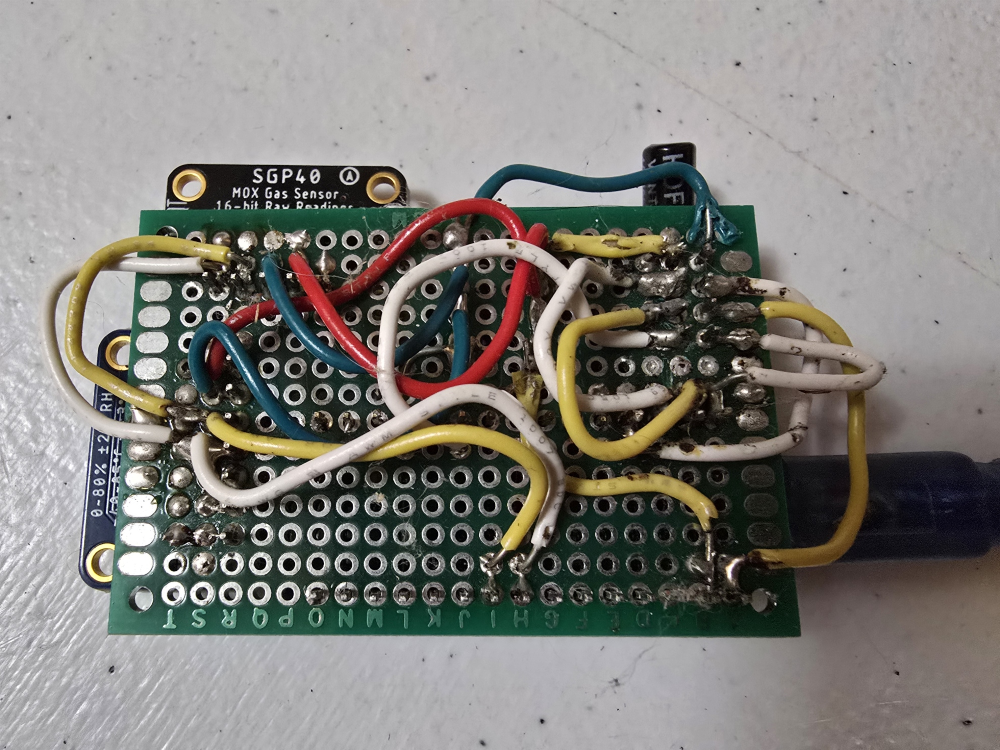

# Low-Cost Air Filtration System for Desktop 3D Printer Emissions

A recirculating air filtration system designed to reduce VOC and ultrafine particle exposure from desktop FDM 3D printers, built for under $100.

  

---

## Problem

Desktop 3D printers emit volatile organic compounds (VOCs) and ultrafine particles (UFPs) during operation. Published research shows emission rates of up to 1.9 x 10^11 particles/min for ABS filament, with styrene and other compounds presenting potential health concerns for long-term exposure.

**My constraints:**
- Rental apartment - no exterior venting allowed
- Budget under $100
  - Limited use of peripheral hardware and equipment
- Must work with existing printer enclosure

---

## Design Approach

### VOC Research

Design started by identifying the various mechanisms and properties of the emissions produced by a 3D printer and their health impacts. While it was found that there are no acute health issues from short-term VOC exposure, there are documented long-term effects with chronic exposure.

For more information see this study: [Emissions of Ultrafine Particles and Volatile Organic Compounds from Commercially Available Desktop 3D Printers](https://pubs.acs.org/doi/abs/10.1021/acs.est.5b04983)

The primary harmful emissions are VOC compounds ranging from styrene (10-110 μg/min for ABS) to lactide (4-5 μg/min for PLA) and caprolactam (2-180 μg/min for nylon-based filaments). Further research was done to determine the various methods and materials that allow for effective filtration of these compounds from the air. The primary methods are MERV filters, Granulated Activated Carbon (GAC), and woven carbon cloth filters.

At the time of this project, there were no open-source or cost-effective solutions that would actually perform adequately.

**Note:** It has been a while since I completed this project. There are now several solutions significantly better than mine available both commercially and as open source. The primary improvement over my design is recirculating filtration (closed loop) versus my open-loop approach, which provides better enclosure temperature control.

### The First (Failed) Approach

The first design attempt used an old computer fan with off-the-shelf MERV and GAC filter media. A rough prototype showed that the computer fan did not have enough static pressure to pass air effectively through the filtration medium. This approach was abandoned.

### The Final Solution

While researching other affordable fan options, I came across a grow room carbon filter. This pre-made filter paired with a standard 4-inch inline fan would meet the filtration objective.

  
  
   
  <em><a href="https://www.amazon.com/dp/B07VKJG4DQ">Carbon filter</a> (left) and <a href="https://www.amazon.com/dp/B07ZL6FDYG">4-inch inline fan</a> (right)</em>

With this, the remaining task was to design a mount to attach the fan and filter to the enclosure (see mechanical design below).

### Mechanical Design

**Objective:** Design a 3D-printed mounting method that did not require modification of COTS parts and could be mounted to the exterior of an existing enclosure (Ender 3 IKEA Lack Table Enclosure).

The design settled on was a ring clamp around the fan comprising two half-cylinders with a print-in-place hinge and an over-center latching mechanism to provide the clamping force. The ring clamp would then twist-lock onto a mounting base plate screwed into the underside of the enclosure. Several holes would be drilled through the enclosure base to allow airflow.

Since the over-center mechanism was going to be the most difficult to design and would be relatively easy to print iterations (most likely faster and more reliable than performing advanced simulations), I decided to make the over-center mechanism a modular sub-assembly that mated to the ring clamp using a dovetail-style joint. This proved useful as there were 3 design iterations.

All parts were designed and modeled in Alibre Atom 3D using a spreadsheet-driven parametric approach for rapid iteration.

**Key assemblies:**
- Fan ring clamp with print-in-place hinges
- Over-center toggle mechanism (3 iterations)
- Enclosure mounting plate

**Over-center mechanism design iterations:**
| Version | Change | Outcome |
|---------|--------|---------|
| V1 | Initial geometry | Insufficient clamping force |
| V2 | Revised leverage ratio | Better force, but structurally weak|
| V3 | Reinforced linkages | Production version |

  
  
   
  <em>Over-center clamping mechanism: CAD model (left) and skeleton model showing linkage geometry (right)</em>

  
   
  <em>Complete exhaust holder assembly</em>

  
  
   
  <em>Print-in-place hinge detail (left) and top view (right)</em>

### Manufacturing and Assembly

All parts were printed and assembled.

All STL files are available in the [STL_and_GCode_Files/](STL_and_GCode_Files/) directory.

A piece of closed-cell craft foam was used as a gasket between the enclosure and the mounting base to act as an air seal. No data on whether this was useful, but it seemed like a reasonable addition.

The mounting base was screwed to the underside of the enclosure using standard washer-head wood screws.

  
   
  <em>Installed filter ring clamp on fan with over-center clamp mechanism</em>

  
   
  <em>Installed system on enclosure</em>

---

### VOC Sensor System

To verify filtration effectiveness, I built an Arduino-based VOC monitoring system with wireless mesh networking capability.

**Hardware per sensor node:**
- Arduino Nano 328p (16MHz)
- Sensirion SGP40 MOx VOC sensor
- Sensirion SHT31 temperature/humidity sensor (for VOC compensation)
- NRF24 radio module (for wireless mesh communication)

**Software architecture:**
- [MySensors](https://www.mysensors.org/) library for wireless mesh networking
- Adafruit SGP40 and SHT31 libraries for sensor communication via I2C
- 1-second sampling interval with temperature-compensated VOC index calculation

**Three-point measurement configuration:**
| Node | Location | Purpose |
|------|----------|---------|
| Gateway | Connected to PC via serial | Data logging and control measurement |
| Node 1 | Inside printer enclosure | Measure emission source concentration |
| Node 2 | Filter outlet / room baseline | Measure filtration effectiveness |

The sensor nodes transmit temperature, humidity, raw VOC values, and computed VOC index to the gateway, which logs data to MongoDB via the Home Assistant MySensors plugin over USB serial. Data was displayed via Home Assistant and Grafana dashboards.

**Note:** Unfortunately, I didn't save the experimental data, and the cats have since used the protoboards as toys, damaging them. As such, I am unable to show the working data or graphs.

  
  
   
  <em>Arduino-based VOC sensor protoboard: front (left) and back (right)</em>

---

## Results

**What worked:**
- VOC levels in surrounding room remained at baseline during extended prints
- No detectable odor outside enclosure during printing
- System operated reliably
- Budget achieved: ~$85-95 total

**Areas for improvement:**
- Higher clamping force and better air sealing for the ring clamp
- Stronger over-center mechanism linkages
- As a learning opportunity, perform an in-depth simulation and analysis of the clamping force and structural strength of the over-center mechanism
- Explore different filtration methods that allow for air recirculation, which would provide better thermal control
- Investigate the thermal runaway issue more closely - currently, if the enclosure is well sealed, the plastic melts too high up in the hot end and prevents extrusion. Leaving the doors open resolves this while still keeping VOC emissions low.

## Files & Resources

- **[Full Technical Documentation](TECHNICAL_DOCUMENTATION.md)** - Detailed write-up with literature review, methodology, and references
- **[Arduino VOC Sensor Code](Arduino_VOC_Sensor_Code/)** - Source code for sensor nodes and gateway
- **[CAD Files](.)** - Alibre Atom 3D source files (.AD_PRT, .AD_ASM)
- **[3D Print Files](STL_and_GCode_Files/)** - STL and gcode files ready to print
- **[Wiring Diagram](Images/wiring_diagram.md)** - Sensor node wiring pinout and connections

---

## Skills Demonstrated

| Category | Skills |
|----------|--------|
| **Mechanical Design** | Alibre Atom 3D, parametric CAD, DFM for FDM printing, mechanism design |
| **Research** | Literature review, technical analysis, experimental design |
| **Prototyping** | 3D printing, iterative design, hands-on fabrication |
| **Electronics** | Arduino, I2C sensors, wireless mesh networking (NRF24/MySensors), data acquisition |
| **Software** | Embedded C/C++, sensor integration, serial communication protocols |
| **Documentation** | Technical writing, project documentation |

---